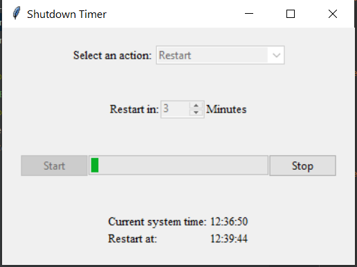

# Shutdown timer GUI app

A toy app made using Python and Tkinter. 
Schedule your PC's next shutdown/restart/etc via a GUI. 
Useful if you want your PC to turn off by itself in some amount of time.  

### Todos 
* Clean up the code a bit 
* Add functionality for restart,hybernate, etc - currently only shutdown is implemented
* Package it as an .exe 
* Make it cross-platform